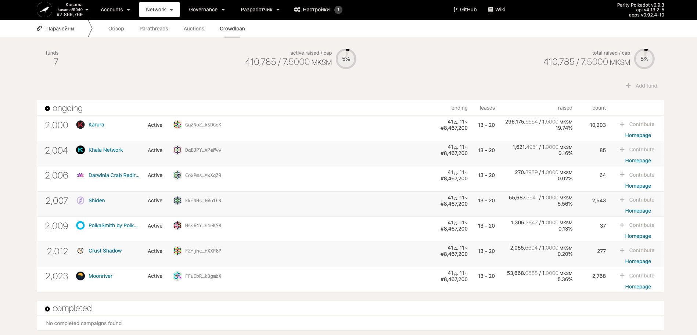
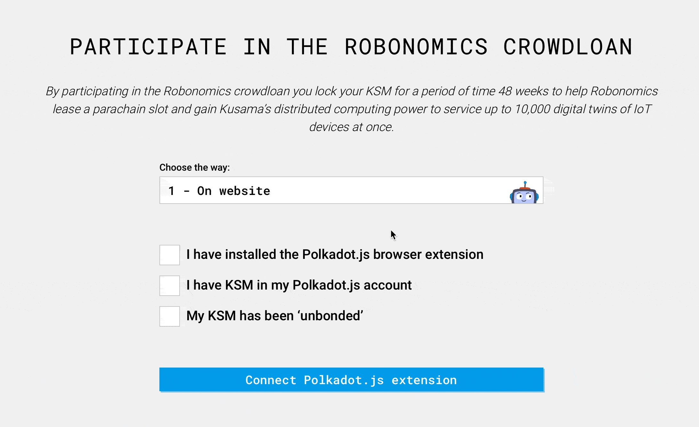

import Card from '~/components/TextCard.vue'

During the summer of 2021, we’ll see the first five auctions that will allow projects to rent Kusama network slots for a period of 48 weeks (or 1 year). Becoming one of Kusama's parachains is a good way to provide access to your Substrate project within the Polkadot ecosystem, implement currently unavailable Blockchain network security to small projects, as well as initiate the integration process with other ecosystem projects as soon as possible. The goal of Robonomics for 2022 is to become a fully functioning conductor of IoT projects to the Polkadot ecosystem. This is why all of the aforementioned benefits of launching a Kusama network are important to us. And in general, our strategy has [already been published](/blog/robonomics-parachain-lease-offering/) a long time ago - "Kusama first, while Polkadot is a vision". In this post, we’ll dissect the use of the Cowdloan module in detail and take a look at the parachain update plan after launching. 

## Kusama crowdloans have started!

*Dr. Gavin Wood, June 8, 2021, [Kusama Parachain Auctions](https://polkadot.network/kusama-parachain-auctions/):*

> The following is the case assuming that no significant and unexpected issues are found with the relay-chain logic. (In such a case, all options should remain on the table for network governance, including pausing or postponing any scheduled or ongoing auctions.)

**Preliminary schedule of auctions:**

- 2021/06/15, 12:00 GMT: First Kusama Parachain Slot auction commences. Bids may be placed.

- 2021/06/22, 12:00 GMT: Second Kusama Parachain Slot auction commences.

- 2021/06/29, 12:00 GMT: Third Kusama Parachain Slot auction commences.

- 2021/07/06, 12:00 GMT: Fourth Kusama Parachain Slot auction commences.

- 2021/07/13, 12:00 GMT: Fifth Kusama Parachain Slot auction commences.

Polkadot allows parachains to source tokens for their parachain bids in a decentralized [crowdloan](https://wiki.polkadot.network/docs/en/learn-crowdloans). Once a crowdloan campaign is open, anyone can participate by sending a special transaction that references the campaign's index. Tokens used to participate must be transferable — that is, not locked for any reason, including staking, vesting, and governance — because they will be moved into a module-controlled account that was generated uniquely for this campaign.

Four projects who launched their KSM crowdloan campaigns (Kurara up to 1,5 mln KSM, Shiden up to 1 mln KSM, Crust up to 1 mln KSM, Moonriver up to 1 mln KSM)  to collect resources for leasing the parachain slot on Kusama during the parachain lease offering auctions. 

Robonomics Dev DAO aims to bid an exact amount of KSM needed for securing a third-fifth parachain slot. Thus, the crowdloan module will be launched right after the end of the auction for 2nd slot on Kusama.

## Estimated time of the Robonomics crowdloan launch is 28 June

You’ll be able to participate in the Robonomics crowdloan through the [dedicated page](/kusama-slot).

**Before participating in the crowdloan, double-check that the campaign is live [on Twitter](https://twitter.com/AIRA_Robonomics).**

## How to participate in the Robonomics Crowdloan 

By default, Polkadot developers provided a native interface in the [Substrate portal](https://polkadot.js.org/apps/#/parachains/crowdloan)

*Example of the Crowdloan page on June 11th, 2021*

At the start of April, Robonomics practised participating in auctions by using the Crowdloan module on the Rococo network. You can check out this Twitter thread to familiarize yourself with the standard interface for community participation in [Polkadot auctions](https://twitter.com/AIRA_Robonomics/status/1377653645827833860)

Also, it’s worth mentioning that on the official [Robonomics site](/kusama-slot), functionality for interacting with the Crowdloan module will be made available.

This is what Crowdloan participation will look like on the Robonomics site after June 28th. 

Instructions on how to use the Crowdloan interface module through the Robonomics website will be published closer to the start of the third auction. 

## Popular questions amongst the community

<Card :back="'transparent'">

### Why does Robonomics participation start only from the third round?

Developers could publish the Crowdloan module today, but then we would have to implement limits. As can be noticed, the first 4 projects that published their Crowdloan modules established a 1 million KSM token limit. 

We’re placing our bets on 100,000 KSM being enough to win one of the Kusama network auctions, but are also reserving space for ourselves to quickly adjust the limit if we come to understand that more KSM tokens will need to be collected by the conclusion of the first and second rounds. In general, we’re trying to manoeuvre in search of an optimal rental cost for a slot.

</Card>

<Card :back="'transparent'">

### What will happen if Robonomics doesn’t win the 5th auction? 

To be honest, we don’t have a plan B. [We'll be like Schwarzenegger](https://youtu.be/Ri-M_Vo3w5A).

</Card>

<Card :back="'transparent'">

### Will it be possible to participate in the Robonomics crowdloan through exchanges? 

Some well-known exchanges like Kraken and Okex are already providing crowdloan support for their users. A list of relevant exchanges that support interaction with the Crowdloan module will be provided on the Robonomics website at the start of the 3rd auction.

</Card>

<Card :back="'transparent'">

### What will happen in 48?

If after 48 weeks the project will once again be unsuccessful in winning an auction, then the parachain will turn into a [parathread](https://wiki.polkadot.network/docs/en/learn-parathreads#docsNav). However, developers have already published preparation plans for future slot auctions: here’s a publication from October 26th, 2020, [Robonomics Parachain Lease Offering, On-chain Governance Strategy](/blog/robonomics-parachain-lease-offering/). But, we also have a secret plan concerning the development of an algorithm to be built into the Robonomics protocol, which will autonomously generate beneficial bonding terms for KSM/DOT holders that will also benefit Robonomics. In general, we contemplate over medium-term issues in advance and continue to think about important matters such as maintaining Robobomics in the state of a parachain today.

</Card>

## Life after auctions

A parachain comes to life inseparably from the moment auction results are concluded. But for a project, this doesn’t indicate that work is over. Remember how the Polkadot Relay Chain launched? The Robonomics team is contemplating over an analogous launch form, increasing functionality accessible to a user in steps. 

## Robonomics will start its existence with the following possibilities: 

- XRT transfers between balances

- Launch of IoT devices using XRT for paying transaction fees 

- Sending IoT device telemetry using XRT for paying transaction fees 

- Sudo

- A technical committee

## Further update plan

- Genesis state: Core functionality (0 week). Launch of the above set of functions.

- Update 0.1: Staking (1 - 3 week). Will allow you to stake your XRT with a 10% APY for token holders and 125% for Crowdloan participants. 

- Update 0.2: Treasury (4 - 6 week). Will allow transferring a share of the DAO funds from Ethereum to the parachain. 

- Update 0.3: RWS (7 - 8 week). Will allow using IoT management functions with not only commission payments but a monthly subscription as well. 

- Update 0.4: Robot-as-a-service (9 - 10 week). Will allow to implement a control process for the provision of automated services and use payments within transactions to launch devices. 

- Update 0.5: Robobank (11 - 12 week). You can read about Robonomics in this article:
https://robonomics.network/blog/robobank-introduction/ 

- Update 0.6: Remove Sudo (13 - 14 week). Developers won’t have the ability to interfere with the operations of the network without the involvement of the technical committee. 

- Ecosystem integration updates (before the end of the year). Further, we will focus attention on integrations with other parachains to expand the capabilities of IoT projects that are interested in what Polkadot can do. 

Stay tuned and follow our updates [on Twitter](https://twitter.com/AIRA_Robonomics)
