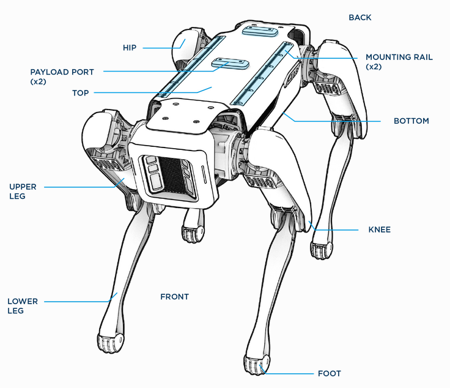
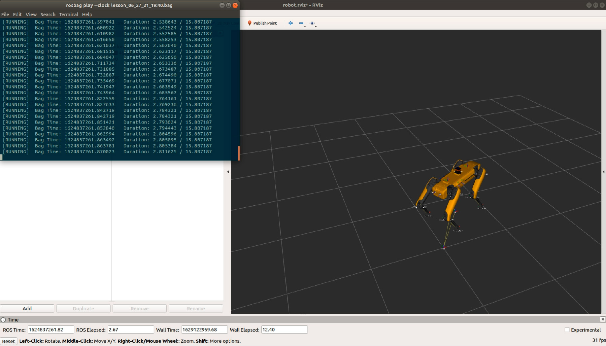

import Card from '~/components/TextCard.vue'

It is time for a new stage of integration with Ocean Protocol. In the [last article](/blog/ocean-protocol-p-2/), we presented our ROS package - ocean_ros, which connects the Ocean API and ROS, and also partially touched on the use case for selling technical logs from the robots. Today we will dive deeper into this use case and describe a specific example of devices’ data tokenization.

First, we need to understand what real practical utility such data and datatokens created from it can bring. It is clear that the service information obtained during the operation of robots and devices is constantly reused to improve algorithms or user experience. But for the most part, this information does not go beyond the device's manufacturer itself. Difficulties begin when devices with a similar principle of operation appear on the market (e.g. robotic vacuum cleaners) or an open platform is released, which is positioned as the basis for other solutions (Raspberry Pi, Arduino, TurtleBot from ROS). For the first case, many of the same types of devices around the world generate gigantic amounts of data dedicated to one specific task. For the second case, developers of open platforms receive unique datasets in their projects in a variety of tasks. However, this experience is not aggregated and shared. It remains unavailable for analysis, which limits the system improvement and makes it hard to find new approaches in the control process.

For example, for motion planning of manipulators, inverse kinematics is a challenge. The joints’ parameters of the kinematic chain need to be found to move the end of the chain to the desired position and orientation. In other words, in order to move the end of the arm to the right position - we need to calculate the positions of every joint the arm has. Often this problem is solved analytically or numerically, but sometimes these approaches have problems, not least computational ones. With the rise of machine learning, [neural network approaches](https://doi.org/10.1016/j.protcy.2013.12.451) began to be used to solve the inverse kinematics, but they require [datasets](https://mint-lab.github.io/awesome-robotics-datasets/) that have information about the motion of a real device for training the model.

Such data needs to be collected and provided to interested parties. This is where [Ocean Protocol](https://oceanprotocol.com/) datatokens come in. They allow automating this process and spur the market of robot datasets. Now this niche is occupied mostly by open datasets, but their main drawback is low quality for business use cases. Let’s move on to our example of robotic data tokenization.

##  Meet Boston Dynamics spot selling its telemetry

Spot is a relevant example of a complex multi-purpose platform with a wide variety of application scenarios. The fact is that working with real Spot telemetry is quite difficult, and this can greatly slow down the development of custom modules for the robot, and even more if the developer wants to use machine learning. Examples of operations that the developer could recover and study would be very useful here, but so far there is very little data available on the use of the robot, especially outside the United States. That's why we want our Spot to become a supplier of high-quality logs of the actual telemetry obtained when performing the same operations. This will give developers multiple repeated records of the same scenario, which should help them develop or improve their own solutions.

## Implementation

The main integration with the Ocean API is provided by our previously written ROS package - [*ocean_ros*](https://github.com/LoSk-p/ocean_ros) To link Spot SDK with ROS abstractions and to work with robot logs inside this operating system, we use [a driver](https://clearpathrobotics.com/assets/guides/melodic/spot-ros/ros_setup.html) created by Clearpath Robotics. You can learn more about how to collect telemetry using the Spot SDK in the [educational program](https://spot-sdk.education/) from our colleagues at Merklebot.

After Spot executes any command, we get a file in rosbag format with data from the /tf ROS topic, which describes the position of Spot frames relative to each other. Frames represent parts of robots and surrounding objects that the robot can see with technical vision. The relationship between two frames is described by a three-element translation vector, which describes the difference between the positions of the origin of two frames, and a rotation quaternion, which shows the difference between rotations of the coordinate systems of two frames. The position of each frame is calculated in relation to the parent frame (for example, the hip relative to the body), the initial frame is the position of Spot at the start.

After Spot executes any command, we get a file in rosbag format with data from the /tf ROS topic, which describes the position of Spot frames relative to each other. Frames represent parts of robots and surrounding objects that the robot can see with technical vision. The relationship between two frames is described by a three-element translation vector, which describes the difference between the positions of the origin of two frames, and a rotation quaternion, which shows the difference between rotations of the coordinate systems of two frames. The position of each frame is calculated in relation to the parent frame (for example, the hip relative to the body), the initial frame is the position of Spot at the start.

*Different parts of Spot and the diagram of the relationship between frames. Source: https://dev.bostondynamics.com/docs/concepts/about_spot.html*

https://youtu.be/6i9zYpCMzn8

The video shows the sequence of commands for creating, selling and buying Spot telemetry datatokens (for more details on how the ocean_ros package works, [see here](https://www.youtube.com/watch?v=Ssit8-u6dZY)). It should be noted that the rosbag file is pre-loaded into the IPFS file system to access it via a hash link, which is used when minting datatokens.

The video also demonstrates the purchase of these datatokens and an example of restoring the entire sequence of commands executed by Spot on a 3D robot model. To do this, we use the [rviz](http://wiki.ros.org/rviz) visualization tool for ROS. Thus, developers can work with any real Spot telemetry, even without having access to the robot.