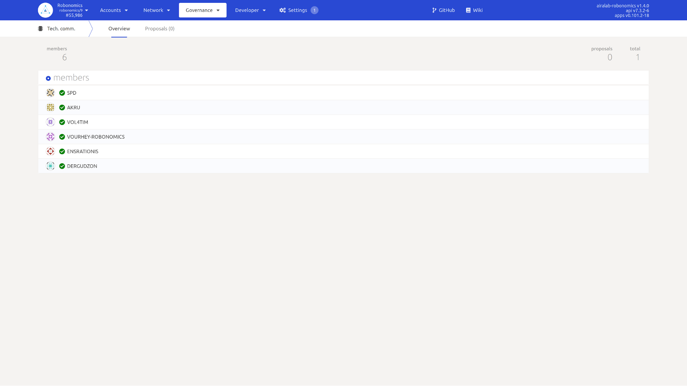
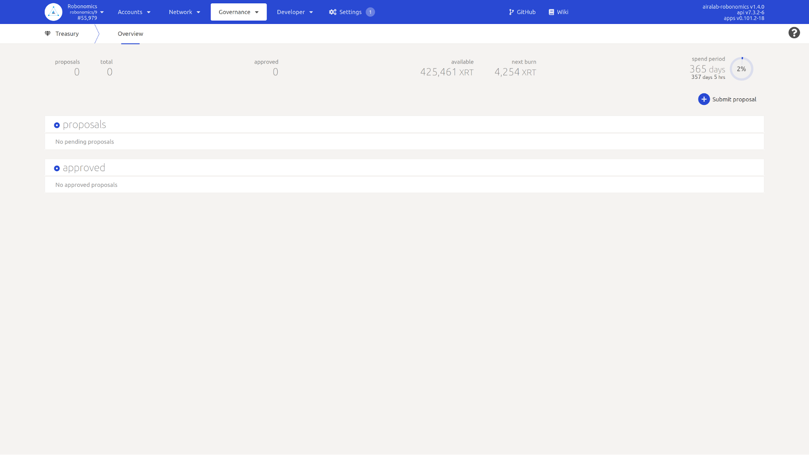
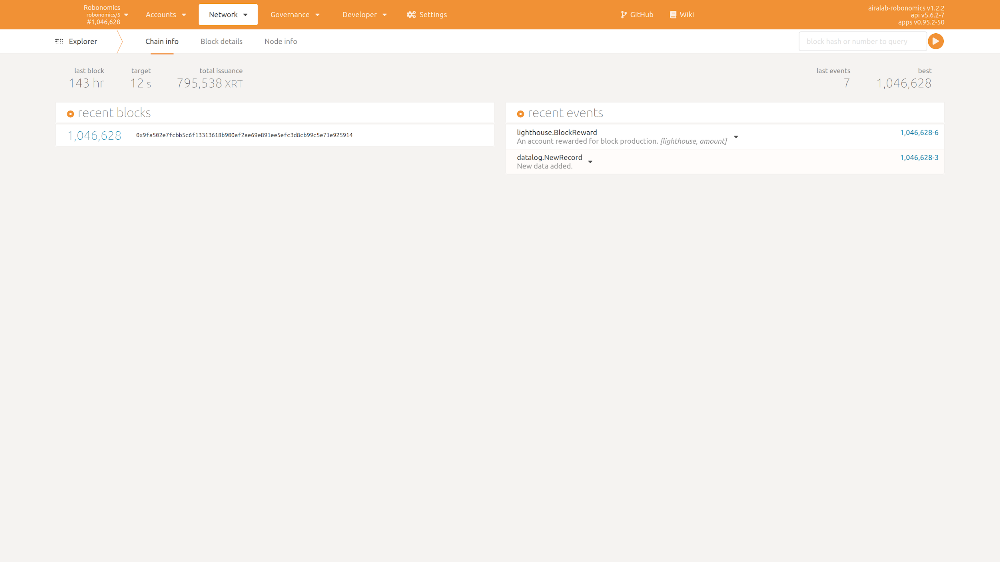

import KusamaSlotBanner from '~/components/blocks/KusamaSlotBanner.vue'
import Card from '~/components/TextCard.vue'

## Базовая инфраструктура парачейна Робономики

Парачейн Робономики [был запущен 9 января 2022 года](https://twitter.com/EnsRationis/status/1480139879057174530). К запуску парачейна был опубликован [релиз 1.4 “Kusama Parachain Launch”](https://github.com/airalab/robonomics/releases/tag/v1.4.0) на GitHub, который может использоваться для запуска [коллатора](https://wiki.polkadot.network/docs/learn-collator).

[Совместно с p2p.org](https://economy.p2p.org/p2p-validator-and-robonomics-announce-partnership-for-launch-of-parachains-on-kusama/), запустили первых коллаторов парачейна. В течение первой недели работы парачейна сформировалась открытая сеть из [40+ коллаторов](https://telemetry.parachain.robonomics.network/#/Robonomics) emerged. 

Напомню, что роль коллатора - собирать блоки и передавать их для проверки в Kusama Relay chain. Коллаторы выполняют вычисления текущего блока и стараются распространить сформированный блок среди валидаторов парачейна как можно скорее. Взамен коллатор получает небольшое гарантированное вознаграждение в XRT за затраченные вычисления + 50% всех комиссий в блоке. 

Среди участников сообщества провели [конкурс второго дня запуска парачейна](https://discord.com/channels/803947358492557312/895723411278557227/930224374630473738). 

На третий день [Subscan переключили](https://twitter.com/AIRA_Robonomics/status/1480833207834664960) работу обозревателя блоков парачейна Робономики из тестнета на mainnet.

Теперь на wiki Робономики можно найти опробованные сообществом инструкции по сборке и запуску коллатора парачейна:

- [how to build a collator node from source](https://wiki.robonomics.network/docs/en/how-to-build-collator-node/)
- [how to launch the Robonomics collator](https://wiki.robonomics.network/docs/en/how-to-launch-the-robonomics-collator/)

Вопросы, связанные с работой коллаторов, можно обсудить:

- в Discord: https://discord.gg/hBJS7uE2NC
- или в Element: https://app.element.io/#/room/#robonomics:matrix.org

## Runtime парачейна на сегодня

Всем, кто ещё не знаком с понятием runtime, советую прочитать для начала данную статью: https://docs.substrate.io/v3/runtime/frame/ 

Текущая структура рантайма Робономики следующая:

<Card>

### Robonomics Parachain

#### Cyber physical system functions
- Digital twin
- Launch
- Datalog
- Robot-as-a-service

#### IoT Subscription
- Subscription auction
- Staking

#### Onchain governance
- Treasury
- Tech comm
- Democracy

#### Token
- Balances
- Transaction 
- Multisig
- Vesting

#### Network maintenance
- Lighthouse 
- Identity

</Card>

Ознакомиться с техническим описанием runtime модулей, специфичных для парачейна Робономики можно по ссылке: https://crates.robonomics.network/pallet_robonomics_datalog/index.html 

А также мы отдельно поговорим о модулях парачейна Робономики ближе к Зимней Школе разработчиков 2022, которая пройдёт в феврале.

## Сформирован технический комитет парачейна

Шесть разработчиков проекта, которые чаще всех участвовали в задачах фронтир сети, были включены в [технический комитет](https://wiki.polkadot.network/ru-RU/docs/learn-governance#technical-committee) парачейна. 

Технический комитет может проводить экстренные референдумы, которые проходят ускоренное голосование и реализацию. Они используются для экстренного исправления ошибок или быстрого внедрения новых, но проверенных в бою, функций в среде выполнения.

## Сокровищница парачейна пополнена и готова к работе

Аналогично тому, как работает [сокровищница](https://wiki.polkadot.network/ru-RU/docs/learn-treasury) в сети Kusama, разработчики Робономики планируют использовать более 400,000 XRT для поддержки сообщества. Ознакомиться с примером запросов в сокровищницу Kusama можно на сайте kusama.polkassembly.io.

Инструкцию о том, как сформировать запрос в сокровищницу Робономики, а также информацию о приоритетных направлениях фондирования можно будет найти в последующих статьях в блоге.

Сокровищница доступна по ссылке: https://polkadot.js.org/apps/?rpc=wss%3A%2F%2Fkusama.rpc.robonomics.network%2F#/treasury

## 1/12 вознаграждения  для участников 4th crowdloan кампании и запуск vesting модуля

Разработчики выполнили отправку 1/12 вознаграждения на балансы crowdloan contributors. Проверить баланс можно с помощью Developer > Chain state > system.account():FrameSystemAccountInfo 

![Robonomics Chain state] (./images/parachain-on-kusama-first-week-report/3-chain-state.png)

Значение Free, как показано на скрине, соответствует 1,102,517,448 Wn ~ 1,1 XRT. И это свободный баланс, доступный для перевода внутри сети.

Модуль vesting также активирован в последнем обновлении runtime. На этой неделе производится отправка 11/12 вознаграждения, которые будут также отображаться в Developer > Chain state > system.account():FrameSystemAccountInfo в пункте “miscFrozen”.

Линейно в течение 11 месяцев полное вознаграждение будет разблокироваться. Сумму, доступную для разблокировки, можно увидеть на странице Accounts в поле “vested”.

Экстра 1 XRT для держателей NFT карточек Робономики можно будет получить ближе к концу января. Об этом разработчики сообщат отдельно в [Twitter](https://twitter.com/AIRA_Robonomics).

## Миграция XRT из фронтир сети

На протяжении последних 6 месяцев мы продолжали тестировать функционал парачейна во [фронтир сети](https://robonomics.network/blog/robonomics-frontier/). На первой недели жизни парачейна в Kusama разработчики остановили работу фронтир сети и распределили балансы в парачейне на Kusama.

Как можно увидеть из скрина, последний блок парачейна Робономики во фронтир сети: 1,046,628, фронтир сеть остановлена 143 часа назад. 

Проверить свой баланс на момент последнего блока во фронтир сети можно по ссылке аналогично проверке баланса в парачейне Kusama: Developer > Chain state > system.account():FrameSystemAccountInfo использую следующую ссылку: 
https://parachain.robonomics.network/?rpc=wss%3A%2F%2Fmain.frontier .rpc.robonomics.network%2F#/chainstate 

Задача переноса балансов из фронтир была, кстати, многослойной и не простой:
- Для начала были собраны свободные токены и токены, находящиеся в стейкинге;
- Далее к ним были добавлены вознаграждения от стейкинга, которые всё ещё не были получены пользователями (not claimed);
- Затем к ним были добавлены вознаграждения, которые были запрошены к выводу, но не забраны из стейкинга;
- Из балансов пользователей были вычтены 11/12 награды за участие в 1ой crowdloan кампании;
- Полученные значения были суммированы и отправлены на один адрес, с которого была произведена дистрибуция;
- 11/12 вознаграждения на одинаковых условиях с участниками 4ой crowdloan кампании были отправлены в vesting на 11 месяцев.

Таким образом начальный баланс участника фронтир сети в парачейне на Kusama должен состоять из:
- Участвовавших в exodus;
- Награды от стейкинга за весь период жизни парачейна во фронтир сети;
- Награды от работ;
- 1/12 вознаграждения от участия в 1ой crowdloan кампании;
- 1/12th of the crowdloan contribution rewards from participation in the 4th (winning) crowdloan campaign.

## XRT staking on Kusama Parachain

Во втором обновлении парачейна Робономики был включён модуль стейкинга XRT.

*Пример работы с разделом стейкинга в dapp Робономики*

Стейкинг XRT доступен в dapp Робономики по следующей ссылке: https://dapp.robonomics.network/#/staking/ 

Награда от стейкинга составляет примерно 10% в год.

Для участников 4ой crowdloan кампании разработчики добавили повышенное вознаграждение в 50%. Обратите внимание, что данный процент вознаграждения от стейкинга ограничен величиной суммы вашего участия в 4ой crowdloan кампании.

Важно отметить, что полная реализация [автономного жизненного цикла парачейна](https://robonomics.network/blog/automating-kusama-crowdloan-campaigns/) изменит константные значения величины вознаграждения от стейкинга на переменные, адаптирующиеся к размеру вознаграждения от стейкинга KSM в Relay chain. Об этом будет рассказано детальнее в Robonomics Whitepaper 2022, после публикации которого мы приступим к изменениям в сети.

## Впереди самое важное!

Сценарии применения Робономики уже [переходят на работу из фронтир сети в Kusama парачейн](https://twitter.com/EnsRationis/status/1481900111856906240). Ближе к концу января мы объявим даты демо недели IoT проектов, готовых представить свои решения на базе парачейна Kusama.

Следите за обновлениями в [Twitter](https://twitter.com/AIRA_Robonomics) и помните, что Робономика не ставит своей задачей быть единорогом среди крипто проектов до тех пор, пока мы не проложим устойчивый путь развития к росту аудитории пользователей. В течение 2022 года нас ждут десятки интересных сценариев применения web3 в области IoT, но только когда Робономика станет полезной для тысячи постоянных пользователей, тогда проект сможет занять достойное место. А пока что всем нам нужно продолжать работать и помогать развитию проекта: пробуйте изменить мир вокруг себя в сторону внедрения web3 технологий, например, подключите Home Assistant к передаче данных от IoT устройств через парачейн Робономики: [видео Leemo](https://www.youtube.com/watch?v=iB2Z8HtERgs) ([Инструкция на GitHub](https://github.com/airalab/robonomics-smarthome)).

<KusamaSlotBanner />