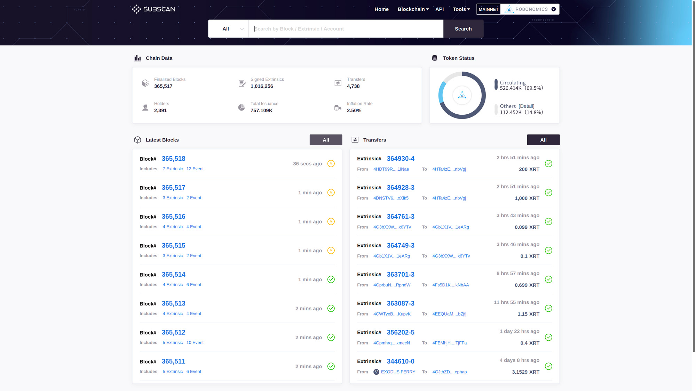
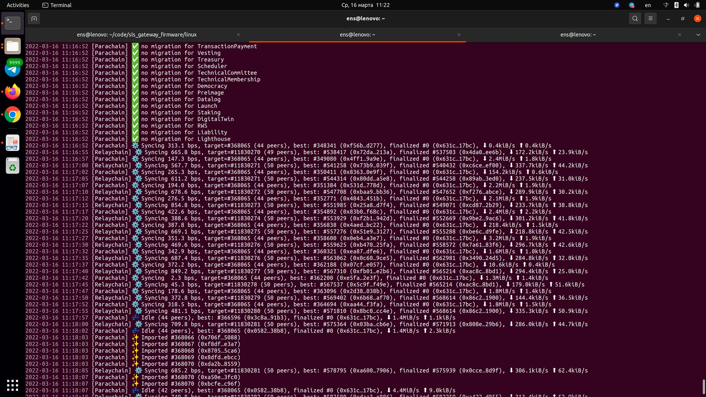

Парачейн Робономики был запущен в январе этого года, а первый публично доступный отчёт о проделанной работе был [опубликован 18 января в блоге](https://robonomics.network/blog/parachain-on-kusama-first-week-report/). Далее будет описание работ, выполненных в рамках задач, обозначенных в дорожной карте на Github: [Tracking issue for Robonomics Parachains on Kusama Launch #145](https://github.com/airalab/robonomics/issues/145).

## О самом важном в работе парачейна Робономики на Kusama за 2 месяца

- Парачейн работает стабильно и обработал первый миллион экстринсиков. Текущая сеть коллаторов также остается открытой и насчитывает примерно [80 коллаторов](https://telemetry.parachain.robonomics.network/#list/Robonomics). Каждый желающий может [стать коллатором Робономики](https://wiki.robonomics.network/docs/en/how-to-launch-the-robonomics-collator/) и получать вознаграждение за подготовку блоков и передачу их валидаторам Kusama.
- [В релизе 1.8.2](https://github.com/airalab/robonomics/releases/tag/v1.8.2) была удалена функция sudo. Изменение принято парачейном в блоке [347,918](https://robonomics.subscan.io/block/347918). Ни у одного разработчика проекта больше нет административных функций управления парачейном.
- [Технический комитет](https://polkadot.js.org/apps/#/techcomm) выполнил первое обновление протокола сети через механизм on-chain governance. Всего за 2 месяца техническим комитетом было обработано около 40 запросов, таких как exodus events, treasury proposals и runtime upgrades.
- [Начиная с релиза 1.8.0](https://github.com/airalab/robonomics/releases/tag/v1.8.0) полноценно доступна функция Robot-as-a-service, с помощью которой вы можете объединять технические и экономические параметры запуска IoT-устройства.
- [Механизм IoT-подписок в парачейне Робономики](https://wiki.robonomics.network/docs/en/get-subscription/) прошёл стадию первых применений в реальных сценариях работы и теперь является основным функционалом парачейна, который разработчики планируют предлагать владельцам домашней инфраструктуры.
- Зимняя школа была приостановлена 24 февраля. Cпустя 3 недели разработчики приняли решение отказаться от продолжения школы как события. Уроки Зимней школы переработаны в формат вводного курса Робономики, который будет доступен весь 2022 год в режиме онлайн 24/7 из любой точки мира. Курс будет опубликован на сайте [robonomics.academy](https://robonomics.academy/) до конца марта.
- Дополнительные 1 XRT для участников crowdoan-кампании, у которых есть карточка пионера [доступны для получения через dapp Робономики](https://dapp.robonomics.network/#/bonus-for-pioneer).

## Статистика парачейна за 2 месяца

Большую часть статистики вы можете самостоятельно найти на обозревателе блоков Subscan.io по адресу: [robonomics.subscan.io](http://robonomics.subscan.io/)

### Парачейн Робономики обработал 1 миллион транзакций

Корректнее говорить [экстринсики](https://wiki.polkadot.network/docs/build-protocol-info#extrinsics), но всё же будем иногда использовать такие допущения для простоты.

Ежедневная нагрузка на парачейн сегодня составляет от 10 до 25 тысяч транзакций в сутки. В основном используется функция datalog() для удаленного сбора данных от IoT-устройств. А также начиная с февраля разработчики начали применять IoT-подписки парачейна для работы первых сценариев Робономики, которые мы готовили в последние 2 года.

Количество полных узлов Робономики, которые передают на [публично доступный сервис телеметрии парачейна](https://telemetry.parachain.robonomics.network/#list/Robonomics), выросло в два раза - с 40 до 80 полных узлов сети. Каждый желающий может [стать коллатором Робономики](https://wiki.robonomics.network/docs/en/how-to-launch-the-robonomics-collator/) и получать вознаграждение за подготовку блоков и передачу их валидаторам Kusama.

## Первые пользователи Робономики

Уже в начале февраля появилась уверенность, что парачейн Робономики готов принять первых пользователей. Привлечение первых пользователей всегда предполагает уделение большого внимания обучению и помощи в любой ситуации, в которую попадёт пользователь ранней версии приложения. А еще это поиск наиболее терпеливых и отзывчивых людей, которым интересны применяемые нами технологии. Да, таких всегда немного, и их сложно найти в количестве большем, чем пара друзей и коллег по работе, но именно такая задача стоит перед нами в 2022 году. Создав сообщество опытных пользователей web3 + IoT, готовых к экспериментам ради образования, мы сможем обеспечить экспоненциальный рост проекта в 2023-2024 годах.

Главное, что мы хотим сделать для привлечения первых пользователей, это разработать несколько обучающих курсов в 2022 году, которые будут не только полезны с точки зрения приобретения навыков, но и интересны в прохождении.

Конечно, разработчики проекта будут устраивать конкурсы и поощрять сообщество за активность. Но всё же мы считаем, что творчество сильнее материального. Круто, когда в процессе обучения можно попробовать [пройти через черное зеркало](https://blackmirror.robonomics.academy/#/) и, пока меняется QR-код на экране, вспомнить любую серию одноименного сериала или сцену из книги Филиппа К. Дика “Убик”, где главный герой ссорится с дверью, которой задолжал пару монет... В общем одной из основных задач команды является сохранение творческого подхода к обучению пользователей в дальнейшем.

Зимняя школа была [приостановлена 24 февраля](https://twitter.com/EnsRationis/status/1496885398404059136). Но первый урок вы всё-таки можете попробовать пройти и сейчас! Для этого перейдите по ссылке: [https://blackmirror.robonomics.academy/#/](https://blackmirror.robonomics.academy/#/)

Кто уже прошел первый урок Школы в феврале, может заметить, что изменился адрес (D)app. Теперь урок доступен на домене robonomics.academy, а в скором времени все 5 уроков, которые мы планировали провести в формате события последней недели февраля будут доступны онлайн 24/7 в формате вводного курса Робономики. Об этом мы обязательно расскажем отдельно.

## Релизы Робономики на GitHub

За последние 2 недели вышло много релизов клиента парачейна Робономики. Наиболее актуальный на момент написания данной статьи - [1.8.4](https://github.com/airalab/robonomics/releases).

[Сборка клиента парачейна Робономики](https://wiki.robonomics.network/docs/en/how-to-build-collator-node/) на Ubuntu 21.10 и запуск без каких-либо сложностей:

Помимо системных обновлений в релизах важно отметить следующие улучшения:

- [Релиз 1.8.0](https://github.com/airalab/robonomics/releases/tag/v1.8.0) - добавлен pallet liability, который позволяет полноценно реализовать модель Robot-as-a-Service и запускать IoT-устройство с передачей технической и экономической информации в атомарном виде.
- [Релиз 1.8.2](https://github.com/airalab/robonomics/releases/tag/v1.8.2) - в парачейне Робономики удалён суперпользователь (sudo). Уже сегодня парачейн Робономики не имеет возможности прямого управления со стороны разработчиков.

Ознакомиться со всеми изменениями клиента парачейна Робономики можно по ссылке: [https://github.com/airalab/robonomics/releases](https://github.com/airalab/robonomics/releases)

## Первый этап дорожной карты 2022 выполнен на 90%

К концу Q1 2022 команда проекта выполнила практически все [задачи по реализации базового функционала парачейна](https://github.com/airalab/robonomics/issues/145), а также уже проходят стадию пилотного использования несколько сценариев Робономики, которые ранее работали только в тестовом режиме. 

### Главная задача Q2 2022 - XCM интеграции

Как можно заметить из [Tracking issue for Robonomics Parachains on Kusama Launch #145](https://github.com/airalab/robonomics/issues/145), в первой части задач остался пункт, связанный с [XCMP](https://research.web3.foundation/en/latest/polkadot/XCMP/index.html)-применением. Первые тесты с обменом сообщениями между 2 экземплярами парачейна Робономики мы реализовали во время [мастер класса в Санкт-Петербурге осенью 2020 года](https://youtu.be/zCH7RuIHEMg). Но за 1,5 года XCMP претерпел много изменений, и теперь корректнее говорить скорее [XCM (Cross-Consensus Message)](https://wiki.polkadot.network/docs/learn-crosschain). 

Gavin Wood представил первую версию XCM осенью 2021 года. XCM хорошо разобран в трёх статьях на medium: 

- [XCM: The Cross-Consensus Message Format](https://medium.com/polkadot-network/xcm-the-cross-consensus-message-format-3b77b1373392)
- [XCM Part II: Versioning and Compatibility](https://medium.com/polkadot-network/xcm-part-ii-versioning-and-compatibility-b313fc257b83)
- [XCM Part III: Execution and Error Management](https://medium.com/polkadot-network/xcm-part-iii-execution-and-error-management-ceb8155dd166)

Уже в феврале мы приступили к доработкам парачейна Робономики, чтобы реализовать первую интеграцию внутри экосистемы Kusama. Наша первая задача в данном направлении - интеграция с Statemine парачейном. Данная интеграция позволит пользователям использовать любые statemine токены для оплаты по модели Robot-as-a-Service, например, [при удалённом управлении телескопом в пустыне Атакама](http://telescope.merklebot.com/) или для реализации оплаты токенами вендинговому автомату в любой точке мира.

Помимо интеграции со Statemine в планах на Q2:

- Интеграция с Karura для добавления пула ликвидности XRT/kUSD.
- Интеграция с Moonriver для управления IoT-устройствами с применением произвольных solidity-контрактов.
- Изучение технологии мостов между Ethereum и Kusama на примере Darwinia.

Каждый сценарий интеграции мы будем описывать отдельно по результатам тестирования в Rococo, Westend или других песочницах, в которых имеют свои тестовые версии парачейны Karura, Moonriver, Darwinia.

## В заключение

Вокруг нас сейчас полный хаос, но команда проекта уже давно обозначила свой курс на web3 вселенную - мы публикуем результаты своей работы в сети Интернет, чтобы в любой точке мира можно было повторить эксперименты, ведь кроме открытого исходного кода и доступа к блокчейн вам не потребуется ничего больше. Конечно, жизнь в мире web3 не так проста, когда дело касается множества деталей, но мы справимся. Будучи инженерами, мы представляем последствия милитаризации в 21 веке. Лучшее, что можно сделать в нынешней ситуации, это лично участвовать в мирных проектах и создавать как можно больше открытого программного обеспечения для задач обычных людей. За последний год нашими силами были начаты такие проекты, как: образовательная программа [удаленного управления робособакой Boston Dynamics](https://spot-sdk.education/); [удаленное наблюдение за звездным небом](https://www.youtube.com/watch?v=Up8hESnXnaY) из наиболее пригодного для этого места на планете Земля - пустыни Атакама; [гражданская сенсорная сеть для наблюдения за качеством городской среды](https://airalab.org/en/air-monitoring) в промышленном городе Тольятти; [мониторинг качества воды в каналах](https://www.youtube.com/watch?v=4iCkdF2UJmo) Санкт-Петербурга. В этом году мы сделаем акцент на сценариях для умного дома, чтобы вы смогли [управлять домашней IoT-инфраструктурой без помощи облаков](https://wiki.robonomics.network/docs/en/home-assistant-begin/). Но об этом уже в следующих обновлениях дорожной карты.