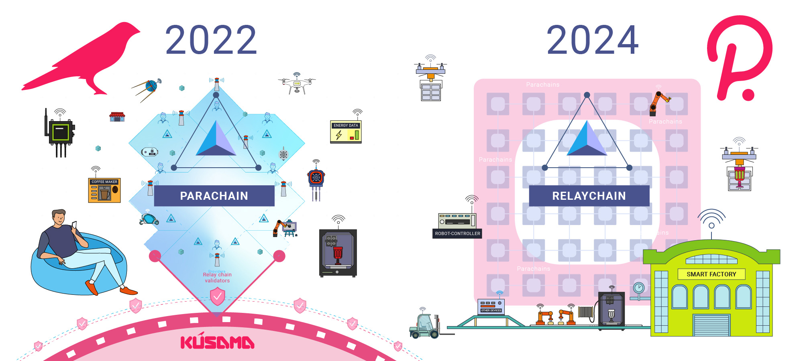
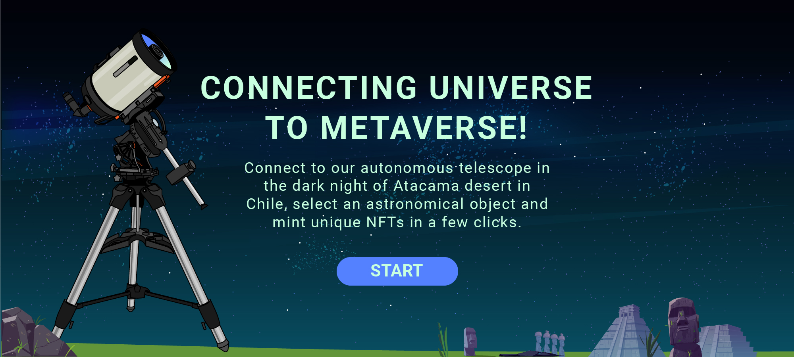
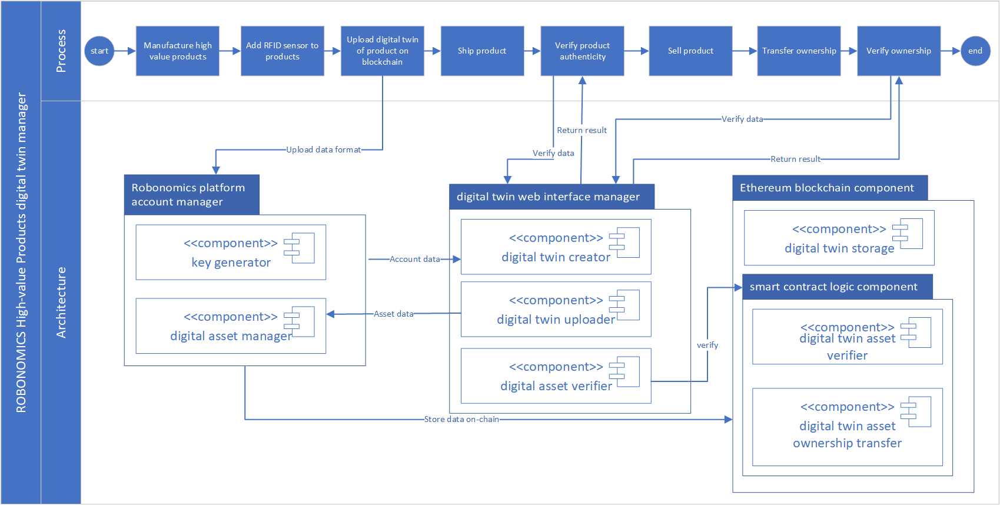

import Card from '~/components/TextCard.vue'

Заканчивается 2021 год и вместе с ним 4-летний цикл изучения технологии Polkadot и R&D работ по реализации парачейна Робономики. Следующий год мы хотим посвятить развитию Робономики, как уже работающей инфраструктуре, сосредоточившись на наиболее жизнеспособных сценариях применения web3 в области Интернета вещей. Самое главное - для этого у нас есть опыт и команда, готовая посвятить своё время не только исследовательской разработке. 

Далее я постараюсь рассказать о продуктах, которые мы планируем выпустить, чтобы предоставить пользователям Робономики полезные в повседневной жизни сценарии применения web3 для IoT.

## Kusama - сеть для подключения персональной IoT инфраструктуры и start up проектов, Polkadot - для корпоративной

Именно так мы себе представляем развитие Робономики как парачейна. Мы хотим начать с реализации в сети Kusama, которая обладает достаточным уровнем кибербезопасности, чтобы обслуживать домашнюю робототехнику, но не подойдет для больших корпоративных историй. Если говорить о b2b применении, Kusama подходит только для start up проектов. Как минимум до тех пор, пока каждый релиз в Kusama не будет сопровождаться независимым аудитом кода и прочими историями, важными для интеграции в бизнес-процессы больших компаний.

Таким образом пользователи Робономики 2022 года - это владельцы домашней IoT-инфраструктуры и start up проекты, которым интересны возможности web3, и они готовы довериться чему-то новому :) 

Далее о том, что мы планируем сделать в следующем году для данной категории пользователей.

## RWS: Робономика для вашего умного дома

В течение 2020 года была разработана базовая архитектура представления парачейна как привычного облака для IoT-устройств. Теперь это часть будущей инфраструктуры Робономики в формате парачейна под названием RWS.

В 2021 году получилось провести множественные [эксперименты по подключению популярных на рынке решений для умного дома к сервисам RWS](https://youtu.be/H-w2FX-zd0M). Теперь разработчики готовы предоставить сервис ежемесячной подписки для тех, кто уже пользуется домашней IoT-инфраструктурой и хотел бы попробовать сервисы на базе web3.

Из конкретных действий для подключения умного дома под управление сетью Kusama мы:

* выполнили начальную связку с наиболее известным opensource решением в области управления умными домами [Home Assistant](https://github.com/home-assistant) и будет продолжать развитие данного направления, чтобы отвязать имеющиеся IoT-хабы в вашем доме от облачных сервисов;
* приступаем к выпуску и глобальной дистрибуции первого IoT-хаба, который будет [совместим с датчиками, работающими по протоколу Zigbee](https://www.amazon.com/zigbee-sensor/s?k=zigbee+sensor) весной 2022 года;
* продолжим [серию публикаций и инструкций](https://blog.aira.life/coworking-for-crypto-anarchists-p1-5ebecb252f2d) о том, как можно организовать пространство в команде без тирании администратора, а лишь с легким ударом электрошокера от домашнего робота Роузи.

Помимо возможности управления через сеть Kusama мы хотим дать всем, кому не безразлично слово “dapp”, попробовать приложения Робономики.

## Приложения на базе Робономики для конечных пользователей

Более 50 человек участвовало в R&D проектах на базе Робономики за последние 5 лет. И как следствие, мы можем наблюдать появление команд, специализирующихся на отдельных применениях и готовых предложить пользователям продукт или сервис.

Фактически это эволюция, которая является следствием роста R&D команды: из команды, выполняющей исключительно публикацию отчётов и инструкций специалистов, в целую экосистему команд, которые уходят в  специализацию под конкретные сценарии и заодно помогают писать разные кусочки программной платформы. На сегодняшний день платформа уже составляет более 10ти часто используемых репозиториев для конкретных видов dapp, подключения IoT или построения чего-то посложнее. Ниже о некоторых из них, а точнее о тех вариантах применения Робономики, которые сейчас превращаются в отдельные start up проекты с участием разработчиков.

### Робособака не только для обучения, а еще и для вдохновения

Программа удаленного обучения работе с BD Spot делает шаги в сторону сертифицирования специалистов с выдачей дипломов о дополнительном образовании университетского формата и выстраивания корпоративных программ обучения, что, я думаю, будет реализовано в течение следующего года. Однако эта область исключительно закрытая, как школа магии в любой фэнтезийной вселенной. Но у Робособаки есть ещё одна интересная особенность: из-за популярности в обществе Спот может быть полезен в более простых сценариях, например, почувствовать себя оператором робота из будущего. В течение 2022 года мы хотим сделать отдельную возможность аренды Спота и трассы для него, чтобы детям, которые не могут поиграть в футбол или же проявить другую физическую активность, открылся портал в мир вдохновения! Ведь представьте себе, как круто может измениться взгляд на то, что тебе доступно, а что нет, после часа управления Робособакой. Мы попробуем запустить такую программу совместно с благотворительным фондом, чтобы помочь сделать выбор будущей профессии в пользу робототехники для тех детей, кому уже сейчас приходится чуть сложнее на и так непростом этапе взросления.

### Веган-техногик

Я редко сознаюсь, но уже более 7 лет являюсь вегетарианцем, хотя и стараюсь быть подальше от встреч с другими вегетарианцами :) Возможно, это специфика России, но, глядя на интересы вегетарианцев, я с опасением замечаю тенденции к образу жизни “Обратно в Средневековье”: натуральное - значит сам выращивал, отсутствие мусора - потому что ешь с бересты… Конечно, спасать Землю от нашего невежества нужно, но я больше верю в роботов и их работу на страже богини Геи, чем во что-то из эко-трендов. 

Чтобы поддержать тех, кто хочет жить в гармонии с природой, но при этом соблюдать правило “Работает машина, а не человек”, мы запускаем проект автоматической компенсации углеродного следа электроэнергии в любой точке мира. Вы покупаете умную розетку в дом, подключаетесь к Робономике и устанавливаете связку с приложением DAO IPCI в [marketplace Робономики](https://dapp.robonomics.network/#/services). Затем ваш умный дом самостоятельно будет учитывать расход энергии в месяц и компенсировать вред, нанесенный при генерации данной э/э, списывая небольшое количество криптовалюты. 

Чтобы реализовать данный сценарий, компания Evercity помогла приобрести углеродные единицы двух проектов с верифицированными результатами и торгами на европейской бирже. Остался запуск. Сервис будет запускаться в феврале-марте 2022 года.

### Первая гражданская сеть сенсоров в России с использованием IPFS и Substrate Blockchain

В родном для многих участников проекта городе Тольятти уже третий год идут эксперименты по построению гражданского мониторинга с использованием автономных IoT-датчиков. В течение 2021 года более 25 датчиков по всему городу отправляли данные в Робономику, а работа карты для мониторинга обеспечивалась в формате dapp. С картой регулярно работали десятки общественных экологов с лета 2021 года.

Узнать больше можно на [сайте](https://airalab.org/) некоммерческой организации Аиралаб Рус, Тольятти.

Сенсорная карта, кстати, глобально открыта - если хотите, подключайтесь, как это сделали десятки любителей. Вот пример видео от сообщества:

https://youtu.be/AQ7ZzgbN7jU

### Feek - система контроля качества для малых производств

Студенческая группа из ИТМО совместно с ООО “Мультиагентные системы” создали и опробовали на двух предприятиях систему контроля качества, легко интегрируемую в рабочее место сборщика или элемент конвейерной линии. Система будет отличаться низкой ценой и высоким уровнем защиты данных.

Приобрести аппаратно-программный комплекс Feek можно будет в 2022 году на сайте https://multi-agent.io/

### Портал из метавселенных в настоящий космос

Продуктовая команда Merklebot готовит к запуску интеграцию с телескопами в Чили, способными сделать фотографию глубокого космоса. С помощью dapp Робономики будет обеспечиваться управление телескопом, а также будет возможность сделать снимок неба и отправить другу NFT-открытку “Привет с Альфа Центавра” 

## Дополнение 1: установление контактов с сообществом

В течение года команда custdev Робономики проводила интервью с разработчиками, профессионалами и экспертами в области робототехники, инженерии, Интернета вещей и облачных технологий, чтобы узнать их точку зрения на web3, распределенные технологии и понять проблемы, с которыми они сталкиваются при разработке программных приложений и технических решений. Мы также собрали отзывы о Робономике и о том, в каких случаях, по мнению респондентов, наша платформа может быть полезна. Ниже мы хотели бы поделиться своими выводами, основанными на этих интервью.

**Статистика по респондентам:**

* Общее количество интервью: 156 респондентов
* География: европейские страны (36%), Индия (22%), США (19%), другие страны (23%)
* Области деятельности: ROS разработчики, инженеры-робототехники, IoT-инженеры, основатели startup-проектов, студенты и профессора: информатика и вычислительная техника, робототехника, машиностроение.

В целом разработчики программного обеспечения для роботов и Интернета вещей все еще смутно понимают концепцию web3 или знают о ней, но не используют эти технологии в своей профессиональной деятельности. Для некоторых респондентов идея использования технологии блокчейн и смарт-контрактов для безопасного управления сетью устройств стала большой неожиданностью. Тем не менее, обсуждая общие проблемы робототехники, многие разработчики пришли к тем же выводам, к которым пришли мы: для полномасштабного внедрения робототехнических устройств в будущем неизбежно встанет вопрос об их надежной аутентификации. Технологии Web3 могут быть возможным решением, которое, кроме того, позволит демократизировать и децентрализовать доступ к роботам для всего человечества.

Ответы подчеркивают идею о том, что обрабатывающая промышленность хочет изменить свою старую бизнес-модель, но еще не знает, как это сделать безболезненно. Несколько специалистов из индустрии B2B в интервью отметили, что крупные компании, с одной стороны, обеспокоены надежностью подключения к IoT через обычные сети, но с другой стороны, они еще не готовы к решениям web3 в качестве альтернативы. Респондентам было рекомендовано продемонстрировать оптимизированные варианты использования, которые обеспечивают более прибыльную и менее дорогостоящую безопасность, чем существующие централизованные решения. Здесь открыта ниша для таких решений как Робономика, и, по словам одного респондента, девиз «будь роботизированным, но понятным для человека» - хороший подход для распространения наших идей. Основным препятствием чаще всего называли юридические нюансы блокчейн и криптовалют, а также то, что мы предлагаем сохранять конфиденциальность данных, отправляемых пользовательскими устройствами, что может противоречить бизнес-моделям некоторых компаний.

Среди наиболее частых упоминаний в рассказах респондентов была проблема дороговизны и сложности развертывания роботизированных решений. Наш общий вывод с респондентами заключался в том, что применение концепции «робот как услуга» и умного лизинга может сделать роботов и Интернет вещей более доступными.

Среди вариантов использования, для которых, по мнению респондентов, наиболее привлекательно использование Робономики, сценарии с публичной сетью (управление трафиком, управление окружающей средой), производство/сбор/хранение экологических данных, IoT-решения для малого бизнеса, создание цифровых двойников.

Далее мы хотели бы представить некоторых наиболее заметных респондентов и их интересные истории.

<Card>

### [Kapil Deshpande](https://www.linkedin.com/in/kapil-deshpande-041193/)

**Род деятельности:** Разработчик программного обеспечения для робототехники (ROS); **Опыт:** ROS, Azure.

Во время интервью с Капилом выяснилось, что мы по-разному пришли к одним и тем же идеям. Участвуя в Azure Hackathon, Капил и его коллеги решили разработать систему «робот как услуга» для бизнеса на основе технологий блокчейн и ROS, аналогичную основным элементам Робономики вначале. Капил считает, что стоимость работы робота до конечной цены продукта можно точно рассчитать с помощью смарт-контрактов, которые связывают экономическую и техническую информацию. И нам, и ему было очень приятно услышать общие идеи, выраженные другими словами, независимо друг от друга. В результате знакомства с Робономикой Капил решил подать заявку на участие в нашей грантовой программе и пройти курсы в Академии Робономики.

</Card>

<Card>

### [Houman Masnavi](https://www.linkedin.com/in/houman-masnavi/)

**Род деятельности:** Разработчик программного обеспечения; **Опыт:** ROS с разными роботами — PAL Robotics TIAGo, KUKA youBot, MiR100, UR5, Jackal UGV, Turtlebot3, Parrot Bebop2.

Интервью с Хуманом - случай, когда глубоко погруженный в робототехнику инженер, упомянутый [в статье](https://blog.ut.ee/robotics-wizard/) как «волшебник робототехники», заинтересовался возможностью использования web3 для роботов. После нескольких интервью Хуман настолько заинтересовался нашим проектом, что стал полноценным наставником Робономики. В настоящее время он наблюдает за нашей wiki, предоставляя содержательные комментарии по ее структуре и проверяя качество руководств и видеоуроков.

</Card>

<Card>

### [Primož Zajec](https://www.linkedin.com/in/primo%C5%BE-zajec-436099a6/)

**Род деятельности:** Разработчик программного обеспечения для архитектурного проектирования Интернета вещей и промышленных систем; **Опыт:** R&D разработка для Интернета вещей.

Примож узнал о Робономике, прочитав нашу R&D книгу. Он был поражен платформой и в интервью дал содержательный отзыв о Робономике. Сделал вывод, что, по его мнению, «для Робономики точно есть рынок». Затем он представил Робономику как решение для проектов, в которые, по его мнению, могла бы вписаться платформа.

</Card>

<Card>

### [Dawit Legese](https://www.linkedin.com/in/dawitlegese)

**Род деятельности:** Java-разработчик; **Опыт:** электротехника и вычислительная техника, информатика.

До своей роли Java-разработчика Давит работал над проектом роботов-гуманоидов, в котором он и его коллеги попытались интегрировать контроллер в роботов, чтобы несколько роботов могли играть в футбол. Для управления данными этих роботов Давит и его команда были сосредоточены исключительно на взаимодействии с потоками данных в реальном времени, а не на облачном хранении данных. Поскольку большая часть бюджета ушла на приобретение роботов, Давиту пришлось взять на себя гораздо больший риск при проведении эксперимента, потому что роботы были самыми дешевыми, а компьютер для обработки данных в реальном времени самым простым. Узнав о модели умного лизинга, которую позволяет реализовать Робономика, Давит чрезвычайно ей заинтересовался.

</Card>

## Дополнение 2: грантовая программа Робономики: результаты года

В мае 2021 года Робономика открыла собственную [грантовую программу](https://github.com/airalab/robonomics-grant-program) для поддержки студентов, молодых ученых и академических специалистов в области кибер-физических систем, Индустрии 4.0 и Интернета вещей. Грантовая программа уже успешно завершила один раунд подачи заявок, а вторая фаза сейчас активно реализуется. В преддверии нового года мы хотим подвести итоги уходящего, поговорить об успехах старых проектов и запуске новых.

Статистика заявок на гранты выглядит следующим образом:

* Форки грантового репозитория  — 12
* Поданные предложения — 6
* Утвержденные предложения — 3

Как мы отметили в [отчете первого раунда](https://blog.aira.life/robonomics-grant-program-the-first-round-is-completed-the-second-round-is-ahead-7ff1dfb80722), мы стали более тщательно отбирать проекты, отдавая предпочтение соискателям из исследовательского и академического сообщества. Поэтому последние предложения поступают от студентов и профессоров европейских университетов, и во многих случаях важным результатом проекта будут публикации в качественных научных журналах и презентации на научных конференциях.

Теперь давайте посмотрим на статус уже запущенных проектов (подробные результаты доступны [в этом репозитории](https://github.com/airalab/robonomics-grant-results)), а затем обсудим новые предложения.

### Прогресс запущенных проектов

<Card>

#### [Robossembler](https://github.com/airalab/robonomics-grant-program/blob/main/proposals/robossembler.md)

С апреля 2021 года команда самого первого утвержденного проекта создает имитационную модель умного завода с цифровым двойником, способного создавать практически полные копии самого себя. За 9 месяцев активной работы участники провели [объемное исследование](https://robosphere.gitlab.io/robossembler-docs/docs/) принципов построения самовоспроизводящихся автоматических систем, которые было бы достаточно просто реализовать. В результате основу производственной ячейки составляет рабочее место в виде сот с манипулятором с 6-ю степенями свободы, к которому можно подключить набор различных инструментов и станков (от пайки и сварки до станка с ЧПУ и 3D-принтера). Для каждого элемента производственной системы [была создана](https://gitlab.com/robosphere) модель STEP, которая может имитировать работу этих узлов.

Команда Robossembler опробовала несколько фреймворков для моделирования и до сих пор использует связку ROS2 + Unity для мультиагентных сценариев и симулятор ROS2 + Ignition Gazebo для моделирования небольших манипуляционных задач. ROS2-tools PlanSys2 и MoveIt2 используются как система для планирования действий и взаимодействий многих участвующих устройств. Команда продолжает работать над архитектурой для интеграции Робономики и недавно представила в журнал IEEE Robotics and Automation Society статью о концепции передачи навыков и программ сборки между устройствами для запуска новых продуктов.

*Модульное рабочее пространство для масштабируемости производственной системы*

Команда публикует все результаты, и каждый может попробовать протестировать некоторые модули фабрики. Примечательно, что команда разрабатывает все элементы на основе реалистичных прототипов и предоставляет на них настоящую конструкторскую документацию. Кто знает, может быть, следующим шагом после симуляции будет построение настоящей самовоспроизводящейся фабрики ...

</Card>

<Card>

#### [AgriDataTrade](https://github.com/airalab/robonomics-grant-program/blob/main/proposals/agridatatrade.md)

Команда из Новой Зеландии работает над созданием системы, которая облегчит экологическое регулирование использования сельскохозяйственных угодий. С этой целью проект AgriDataTrade организует на фермах безопасный автоматизированный сбор различных данных о состоянии почвы (нитраты, фосфаты, парниковые газы ит.д.), чтобы затем запустить токенизацию данных. В конечном итоге это создаст рынок почвенного кредита, аналогичный рынку углеродного кредита.

Проект AgriDataTrade был запущен 4 месяца назад, и за это время команда получила необходимые наборы датчиков (датчики Hach, способные измерять pH, нитраты, проводимость и другие показатели) и согласовала с несколькими хозяйствами их размещение. Для подключения датчиков используется плата Arduino, которая, используя локальную мобильную сеть по протоколу MQTT (см. [Репозиторий](https://github.com/AgriData-Trade/robonomics_mqtt)), подключается к удаленному серверу, который создает узлы для этих датчиков в сети Робономики. Команда уже развернула сервер в Университете Виктории в Веллингтоне и через несколько недель запустит тестовую сеть датчиков на одной из ферм.

*Тестовая карта, на которой будут отображаться данные с датчиков*

</Card>

### Новые проекты

<Card>

#### [LogisticsBDT](https://github.com/airalab/robonomics-grant-program/blob/main/proposals/LogisticsBDT.md)

Последний проект, одобренный программой грантов, это цифровой двойник логистического блокчейна, предложенный группой исследователей из Университета прикладных наук Верхней Австрии и Таллиннского технологического университета. Проект направлен на выявление контрафактной продукции и проверку подлинности продукции в цепочках поставок с высокой добавленной стоимостью. Это серьезная проблема как для пользователей продукции, так и для самих производителей (например, в тяжелой промышленности, автомобилестроении, авиации, фармацевтике), так как создает дополнительное экономическое и юридическое бремя для контроля над цепочкой.

Исследователи предлагают систему на основе цифровых двойников продуктов с использованием IoT-датчиков (например, RFID-меток) и сети Робономики, которая гарантировала бы соблюдение подлинности и передачу прав. Чтобы проверить возможности такой системы, заявители намерены создать реалистичную симуляцию такой цепочки поставок, которой будет управлять система управления, основанная на датчиках и Робономике.

По результатам проекта авторы планируют разработать спецификацию использования блокчейн-систем и IoT в цепочках поставок с высокой добавленной стоимостью и опубликовать ряд статей на эту тему.

*Архитектура системы аутентификации*

</Card>

<Card>

#### [Идентификация на основе местоположения в разработке Индустрии 4.0](https://github.com/SaschaKaven/robonomics-grant-program/blob/main/proposals/sensorchain_security_%20interface.md)

Этот проект все еще проходит согласование в ДАО Робономики, но мы хотели бы представить его сейчас, поскольку он затрагивает тему предыдущего. Исследователи из Гамбургского университета прикладных наук также стремятся обеспечить подлинность и целостность данных о продукте в процессе производства, для чего они предлагают создавать цифровые идентификаторы объектов путем блокчейнизации данных различных датчиков (исследователи называют этот механизм sensorchain или  цепочка датчиков). Команда аналогичным образом предлагает использовать для этого RFID-метки и обеспечивать идентификацию устройств путем сопоставления с местоположением этих устройств (proof-of-location). Робономика используется для создания и хранения цифровых двойников продуктов и датчиков.

Но в проекте авторы хотят пойти дальше и собрать на основе конструктора Fischertechnik испытательный стенд, который будет моделировать завод и на котором будут тестироваться все разработки. Это делает проект очень интересным, так как, во-первых, у Робономики есть [аналогичная фабрика](https://youtu.be/LjIB3-4kQ0A), построенная из такого конструктора, а во-вторых, разработку проекта LogisticsBDT можно довольно просто совместить с этим тестовым стендом для получения дополнительных результатов. Так что пожелаем команде удачи!
Это был продуктивный год для научно-исследовательских проектов, основанных на Робономике, и мы надеемся, что следующий будет еще более насыщенным.

</Card>

<Card :icon="'/icons/icon-notification.png'" :link="'https://twitter.com/AIRA_Robonomics'">

### Присоединяйтесь к нам в Twitter

Следите за обновлениями и объявлениями

</Card>
